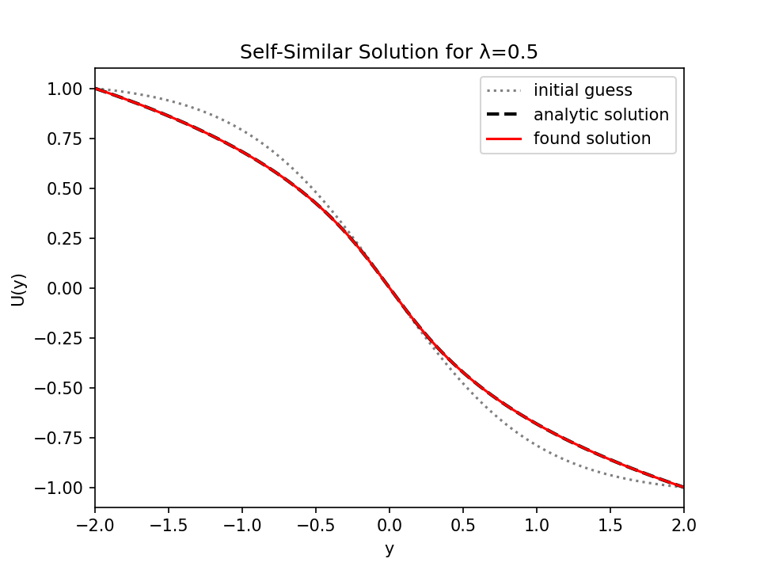
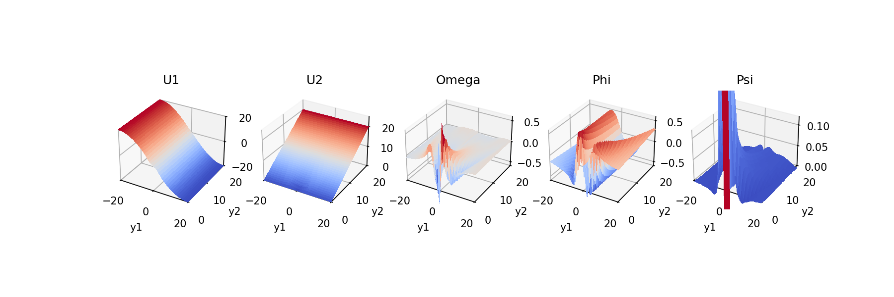

# Blow-Up

Philip Mocz (2025)

Look for blow-up solutions to PDEs with differentiable JAX code. This is an alternative to using PINNs.

## Burgers 1D

[`python search_burgers.py`](https://github.com/pmocz/blowup/blob/main/search_burgers.py)

## Boussinesq 2D

[`python search_boussinesq.py`](https://github.com/pmocz/blowup/blob/main/search_boussinesq.py)

## References

* [Wang+ (2025). High precision PINNs in unbounded domains:
application to singularity formulation in PDEs](https://arxiv.org/abs/2506.19243)
* [Wang+ (2025). Discovery of Unstable Singularities](https://arxiv.org/abs/2509.14185)
